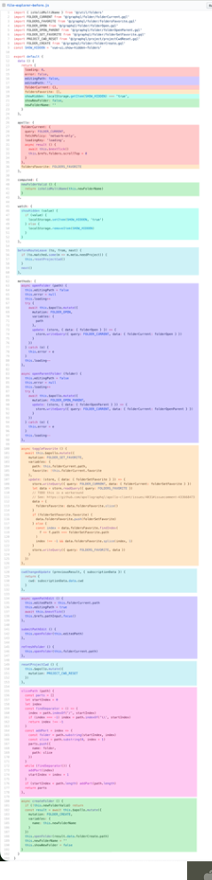
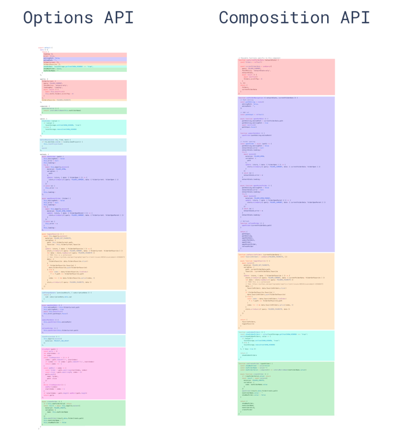

# Vue.js Options APIの課題と<br>Composition APIのメリット
---

## 1. 背景

- 前職でVue2のOptions APIを使っていた
- Vue3でComposition APIが推される理由が気になった

---

## 2. Options APIとは

- Vue2から使われている従来のコンポーネント定義方法

```javascript
export default {
  data() { return { count: 0 } },
  methods: {
    increment() { this.count++ }
  },
  computed: {
    doubled() { return this.count * 2 }
  }
}
```

---

## 3. Composition APIとは

- Vue3で導入された新しいコンポーネント定義方法

```javascript
import { ref, computed } from 'vue'

const count = ref(0)
const doubled = computed(() => count.value * 2)
function increment() { count.value++ }
```
---

## 4. Options APIの課題

OptionsAPIでは下記の課題があった

- コードが散在しやすい
- 機能の再利用が難しい
- TypeScriptとの相性が悪い（型推論・型安全が弱い）


---

## 課題1: コードが散在する

- 同じ機能に関するコードがdata, methods, computedなどに分散
- ロジックを理解・修正する時にあちこち探す必要がある



---

## 解決1: コードをまとめて書ける

- Composition APIなら関連ロジックをsetup関数内にまとめて書ける
- 理解や修正が楽になる



---

## 課題2: 機能の再利用が難しい

- ユーティリティ関数：状態の共有ができない
- ミックスイン：名前の衝突や、どのミックスインが何を提供しているか分かりづらい
- 特にミックスインは複雑化しやすく、保守が大変

---

## 解決2: 機能の再利用が簡単

- コンポーザブル関数として状態とロジックをセットで切り出せる
- 再利用しやすく、名前の衝突も回避できる

```javascript
import { useValidation } from './useValidation'

...
const { value, error, validate : validateUser } = useValidation()
```

---

## 課題3: TypeScriptとの相性が悪い

- Options APIでTypeScriptを使うと型定義が煩雑
- 推論・型安全が弱い(存在しないプロパティにアクセスしても型エラーにならない)

```typescript
interface ComponentData { user: { name: string } }
interface ComponentMethods { updateUser(name: string): void }

export default Vue.extend({
  data(): ComponentData {
    return { user: { name: '' } }
  },
  methods: {
    updateUser(newName: string) {
      this.user.name = newName
      this.user.age++  // 実行時にエラー
    }
  }
});
```

---

## 解決3: TypeScriptとの相性が良い

- Composition APIは標準的なTypeScript機能がそのまま使える

```typescript
import { ref } from 'vue'

const user = ref({ name: '' }) 
const updateUser = (newName: string) => {
  user.value.name = newName
  user.value.age++ //　型エラーになる
}
```

---

## まとめ
CompositionAPIはOptionsAPIの課題を解決するために生まれた

- 関連ロジックを直感的にまとめやすくなった
- 状態とロジックの再利用がよりシンプルに
- TypeScriptがより自然に使える

みなさんも新規ロジックを書くときはCompositionAPIを利用してください！

---

# ご清聴ありがとうございました！
